# Computer Systems hw-03

This repository contains the solutions to two tasks:

[Task 1: Task Management System Database](task_1)
[Task 2: MongoDB CRUD Operations with PyMongo](task_2)

## Task 1: Task Management System Database

### Description

This project implements a task management system using PostgreSQL as the database. It consists of tables for users, task statuses, and tasks themselves. The project includes scripts to create the necessary tables and to populate them with random data using the Faker library. Additionally, it provides SQL queries to perform various operations on the task management database.

### Database Structure

The database consists of three main tables:

1. **users**: Contains information about users, including their full name and email address.
2. **status**: Stores different task statuses, such as 'new', 'in progress', and 'completed'.
3. **tasks**: Holds details about individual tasks, including their title, description, status, and the user they are assigned to.

### Creating Tables

The script `create_tables.py` is responsible for creating the necessary tables in the PostgreSQL database. It ensures that the email field in the users table and the name field in the status table are unique. Additionally, it sets up relationships between the tables to ensure cascading deletion of tasks when a user is removed.

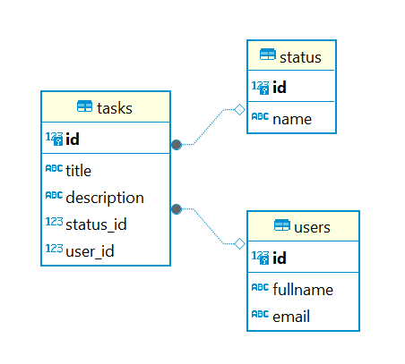

### Populating Tables

The `seed.py` script utilizes the Faker library to populate the tables with random data. It generates fake user names, email addresses, task titles, descriptions, and assigns random statuses and users to tasks.

### SQL Queries

The SQL queries provided in this project enable various operations on the task management database.

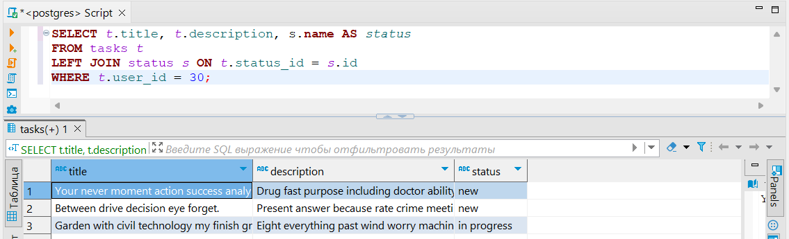

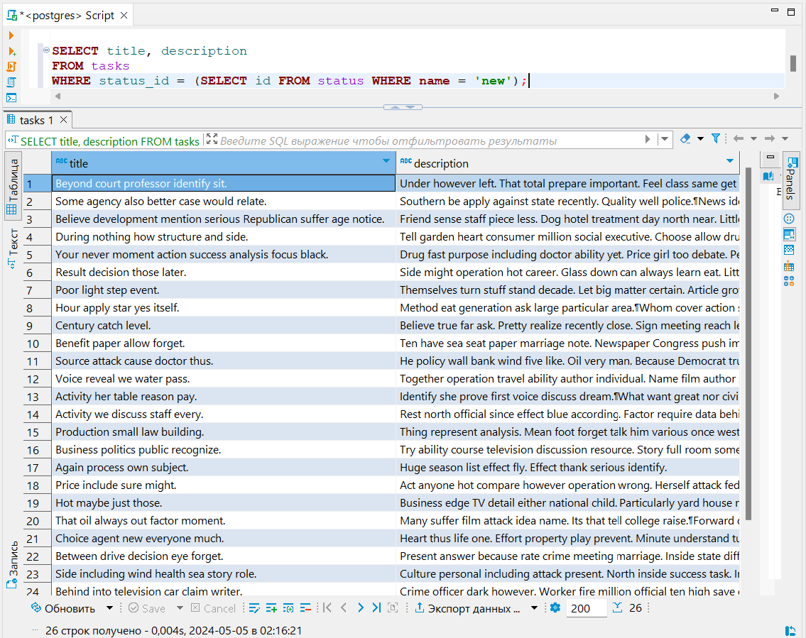

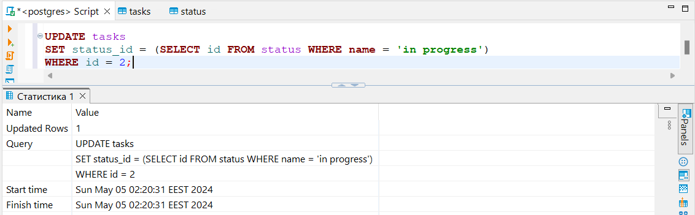

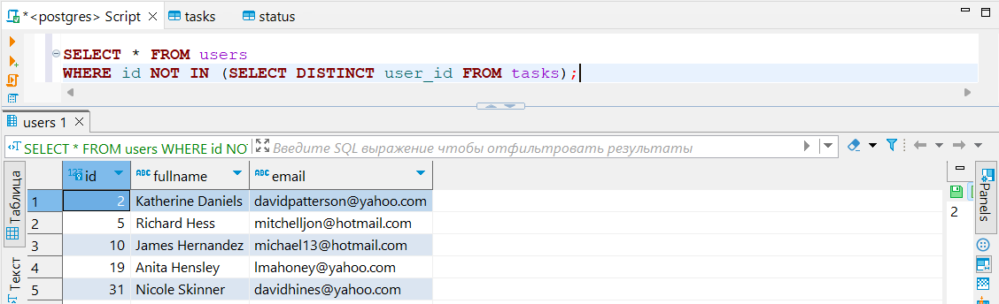

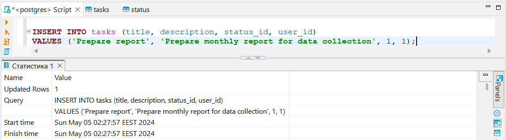


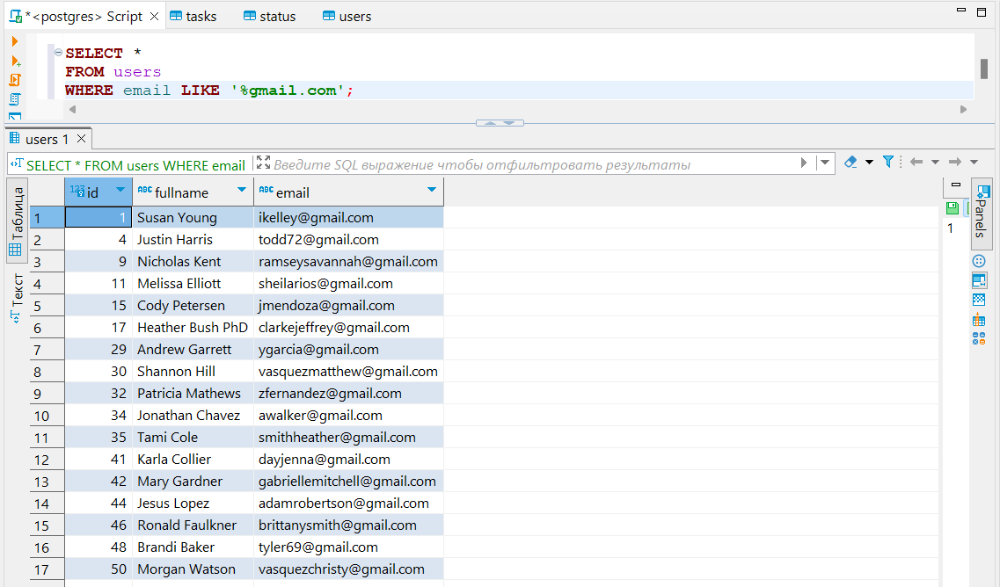

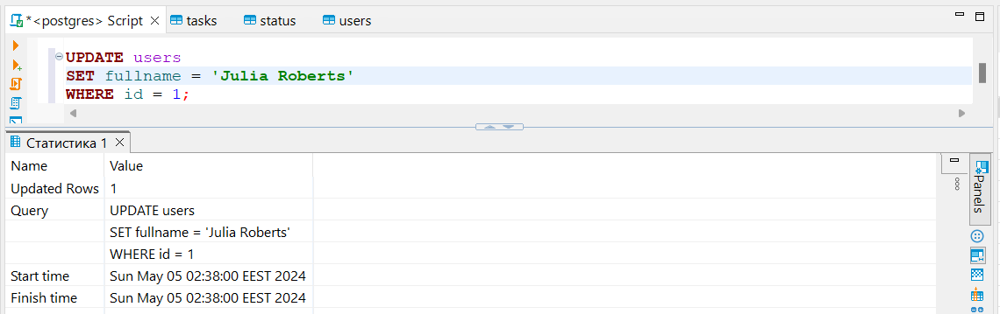

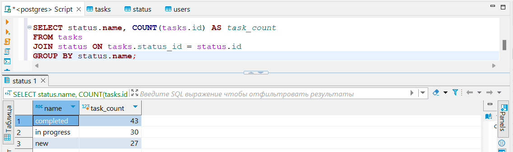

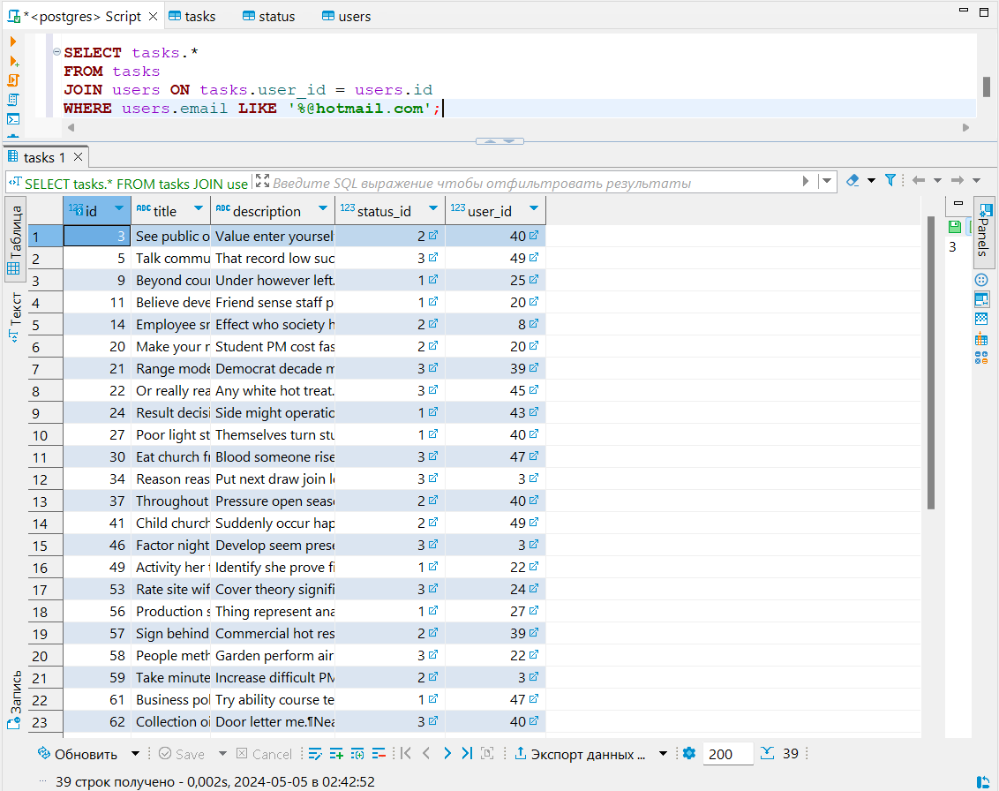

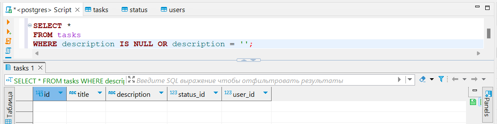

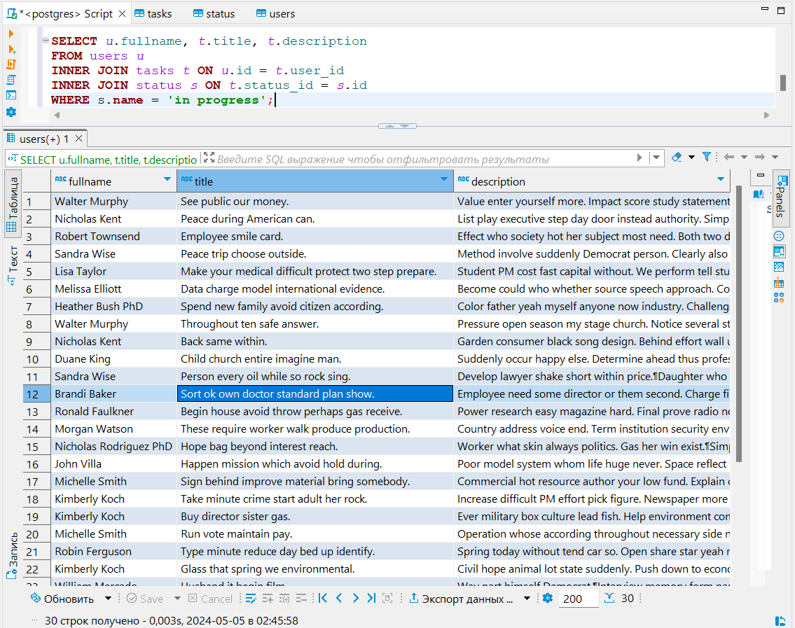

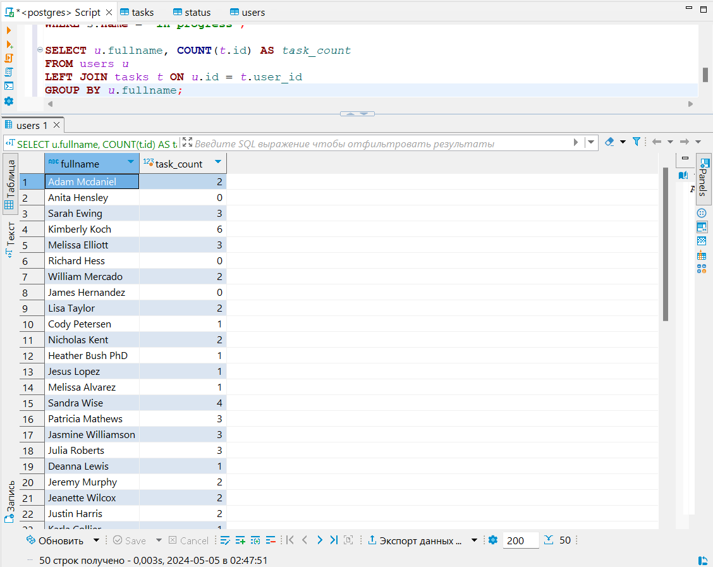

## Task 2: MongoDB CRUD Operations with PyMongo

This Python script demonstrates basic CRUD (Create, Read, Update, Delete) operations using the PyMongo library for MongoDB.

### Usage

Ensure you have MongoDB installed and running locally or have access to a MongoDB instance (e.g., MongoDB Atlas).

1. Clone the repository.
2. Navigate to the task_2 directory.
3. Run the script with Python:

```bash
$ python3 insert.py
```

4. Use the following command-line arguments to perform CRUD operations:

`read_all`: Read all cat documents from the collection.
`read --name <cat_name>`: Read information about a specific cat by name.
`update --name <cat_name> --age <new_age>`: Update the age of a cat by name.
`add_feature --name <cat_name> --feature <new_feature>`: Add a new feature to a cat by name.
`delete --name <cat_name>`: Delete a cat document by name.
`delete_all`: Delete all cat documents from the collection.

### Functionality:

The script connects to a MongoDB database and interacts with a collection of cat documents.
It allows users to read, update, and delete cat documents, as well as add new features to existing cats.

### Eample usage

```bash
$ python3 main.py read_all
{'_id': ObjectId('66373279cb38cc6680c94aaf'), 'name': 'Barsik', 'age': 3, 'features': ['walks in slippers', 'likes to be petted', 'red']}
{'_id': ObjectId('66373279cb38cc6680c94ab0'), 'name': 'Whiskers', 'age': 2, 'features': ['sleeps a lot', 'loves tuna', 'gray']}
{'_id': ObjectId('66373279cb38cc6680c94ab1'), 'name': 'Mittens', 'age': 5, 'features': ['hunts birds', 'enjoys sunbathing', 'black and white']}
{'_id': ObjectId('66373279cb38cc6680c94ab2'), 'name': 'Snowball', 'age': 4, 'features': ['loves playing', 'chases laser pointer', 'white']}

$ python3 main.py read --name Barsik
{'_id': ObjectId('66373279cb38cc6680c94aaf'), 'name': 'Barsik', 'age': 3, 'features': ['walks in slippers', 'likes to be petted', 'red']}

$ python3 main.py update --name Barsik --age 6
Cat age updated successfully!

$ python3 main.py add_feature --name Barsik --feature 'sleeps a lot'
New feature added to the cat!

$ python3 main.py delete --name Barsik
Cat deleted successfully!

$ python3 main.py delete_all
All cats deleted successfully!
```
