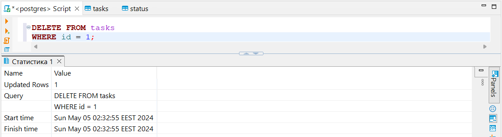

# Computer Systems hw-03

This repository contains the solutions to two tasks:

[Task 1: Task Management System Database](task_1)

## Task 1: Task Management System Database

### Description

This project implements a task management system using PostgreSQL as the database. It consists of tables for users, task statuses, and tasks themselves. The project includes scripts to create the necessary tables and to populate them with random data using the Faker library. Additionally, it provides SQL queries to perform various operations on the task management database.

### Database Structure

The database consists of three main tables:

1. **users**: Contains information about users, including their full name and email address.
2. **status**: Stores different task statuses, such as 'new', 'in progress', and 'completed'.
3. **tasks**: Holds details about individual tasks, including their title, description, status, and the user they are assigned to.

### Creating Tables

The script `create_tables.py` is responsible for creating the necessary tables in the PostgreSQL database. It ensures that the email field in the users table and the name field in the status table are unique. Additionally, it sets up relationships between the tables to ensure cascading deletion of tasks when a user is removed.

### Populating Tables

The `seed.py` script utilizes the Faker library to populate the tables with random data. It generates fake user names, email addresses, task titles, descriptions, and assigns random statuses and users to tasks.

### SQL Queries

The SQL queries provided in this project enable various operations on the task management database.

